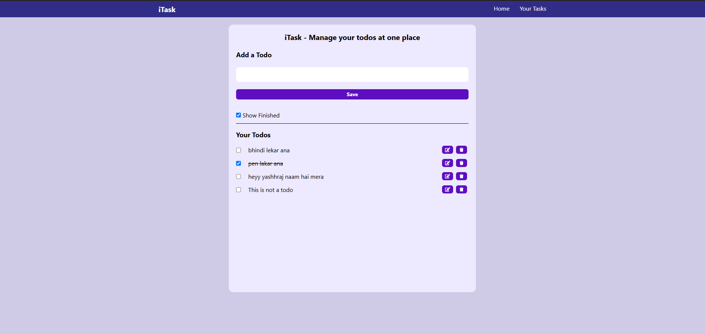

# iTask 📝 - React Todo App

**iTask** is a simple and elegant Todo List app built using **React** and **Tailwind CSS**. It helps you keep track of your daily tasks with features like adding, editing, deleting, and marking tasks as complete. All data is saved in your browser using **localStorage**, so your tasks stay even after refreshing the page!

## ✨ Features

- ✅ Add new tasks
- 📝 Edit existing tasks
- 🗑️ Delete tasks
- 📌 Mark tasks as completed
- 🔄 Automatically saves data using localStorage
- 🎨 Beautiful and responsive UI with Tailwind CSS

## 📸 Screenshots

> *Optional: Add a screenshot of your app in a `screenshots` folder and update the path above.*

## 🚀 Tech Stack

- **React.js** – Frontend library
- **Tailwind CSS** – Utility-first CSS framework
- **UUID** – For generating unique task IDs
- **LocalStorage** – For persistent task storage
- **React Icons** - For adding icons

## 📂 Folder Structure

iTask/
├── public/
├── src/
│   ├── components/
│   │   └── Navbar.jsx
│   ├── App.jsx
│   ├── App.css
│   └── main.jsx
├── package.json
└── README.md

## 🧠 How It Works

- `useState` is used to manage the current input and task list.
- On first load, `useEffect` fetches saved tasks from localStorage.
- Another `useEffect` auto-saves the tasks into localStorage on any update.
- Task completion toggle is handled by checkboxes with visual feedback (line-through).

## 💻 Getting Started

### Prerequisites

- Node.js and npm installed

### Installation

#### Clone the repo
git clone https://github.com/your-username/iTask.git

#### Navigate into the project
cd iTask

#### Install dependencies
npm install

#### Start the development server
npm run dev

## 📢 Contributing

Contributions are welcome!
Feel free to fork this repo, open issues, and submit pull requests.

## 🧾 License

This project is licensed under the [RGIPT License]().

## 🙋‍♂️ Author

Made with ❤️ by [Yashraj Singh Meel](https://github.com/your-username)

### ✅ What to Do Next:

1. Save this content into a file named `README.md` in the root of your project.
2. Replace `your-username` with your GitHub username.
3. Add a screenshot if you'd like — or delete that section.
4. Commit and push your project to GitHub.

Let me know if you want a dark-theme badge style, deploy instructions (like Netlify or Vercel), or a Hindi description version!
